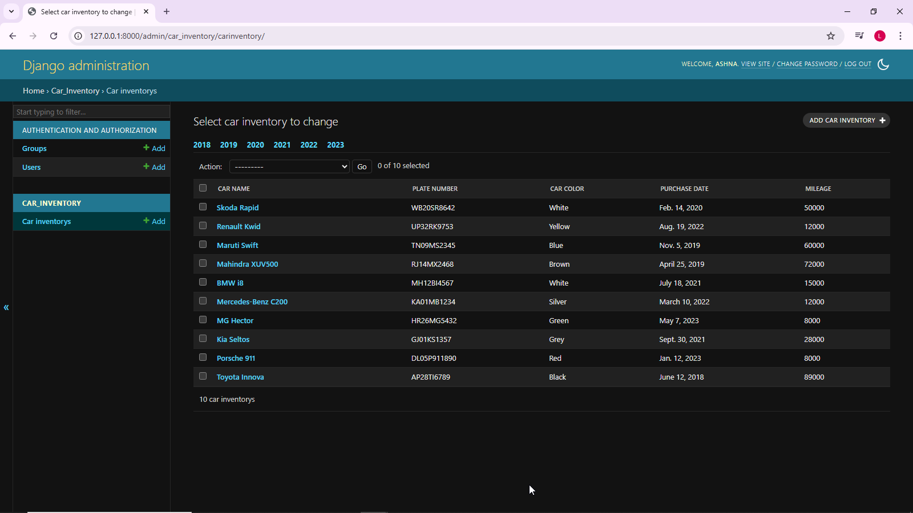

# Ex02 Django ORM Web Application
# Date:21\09\2025
# AIM
To develop a Django application to store and retrieve data from a Car Inventory database using Object Relational Mapping(ORM).
## DESIGN STEPS
## STEP 1:
Clone the problem from GitHub

## STEP 2:
Create a new app in Django project

## STEP 3:
Enter the code for admin.py and models.py

## STEP 4:
Execute Django admin and create details for 10 books

# PROGRAM
```
admin.py
from django.contrib import admin
from .models import CarInventory
class CarInventoryAdmin(admin.ModelAdmin):
    list_display=["car_name"]
    fieldsets = (
        ("Car Details", {
            "fields": ("car_name", "plate_number", "car_color")
        }),
        ("Purchase & Specs", {
            "fields": ("purchase_date", "mileage")
        }),
    )
    list_display=["car_name","plate_number","car_color","purchase_date","mileage"]
    date_hierarchy="purchase_date"
    actions_selection_counter=True
admin.site.register(CarInventory,CarInventoryAdmin)
---
models.py
from django.db import models
from django.contrib import admin

class CarInventory(models.Model): 
    car_name = models.CharField(max_length=100)
    plate_number = models.CharField(max_length=100, primary_key=True)
    car_color = models.CharField(max_length=100)
    purchase_date = models.DateField()   
    mileage = models.IntegerField()


    def __str__(self):
        return f"{self.car_name} ({self.plate_number})"

```
# OUTPUT


# RESULT
Thus the program for creating a database using ORM hass been executed successfully
